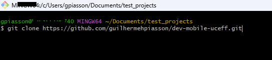
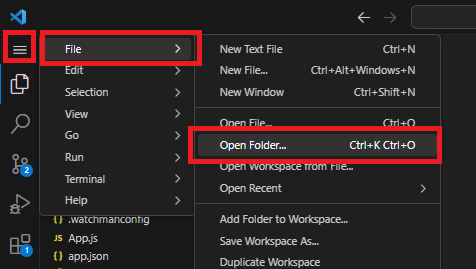
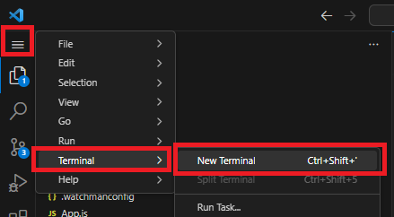
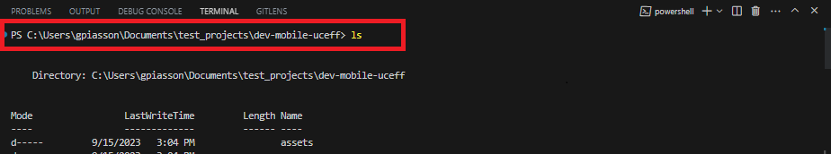
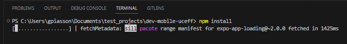

# [Dev-Mobile-Uceff]() 

   

Abaixo temos as principais instruções para então efetuar o clone do repositório e então executá-lo localmente

## Setup Inicial

Para executar esse projeto com o expo (https://docs.expo.dev/get-started/installation/) precisamos ter alguns softwares disponíveis em nossa máquina:

1. Node.js LTS release - https://nodejs.org/en
2. Git - https://git-scm.com/downloads
3. Visual Studio Code - https://code.visualstudio.com/download

## Imagens de Preview

## Start do Projeto

1. Crie uma pasta em seu sistema, acesse a mesma via prompt e execute o comando `git clone https://github.com/guilhermehpiasson/dev-mobile-uceff.git` conforme imagem abaixo:

2. Abra o VSCode e abra a pasta do projeto clonado: `File > Open Folder`
 

3. Abra um terminal:

4. Navegue até dentro da pasta do seu repositório clonado no Github:

OBS.: Utilize comandos como `cd <nome do diretório>` para acessar um diretorio/pasta, `cd ..<nome do diretório>` para voltar a um diretório/pasta anterior e claro, dispare um comando `ls` pra listar os arquivos ou `pwd` pra saberem que diretório vc está e validar onde vc está :)

5. Instale o expo:
`npm install -g expo-cli --force`

6. Instale as dependencias:
`npm install`

Obs.: No caso de incompatibildiade com a versão do Node.js execute `npm install --legacy-peer-deps --force`

7. Execute o expo:
`npx expo start`

8. Troubleshooting:
`npm start --reset-cache`

